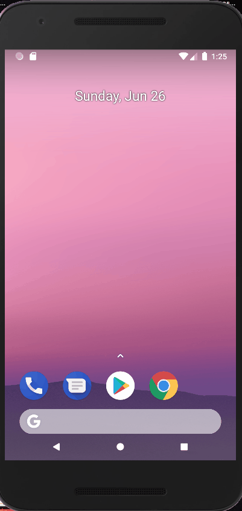

# Shop App (Rest Api)
## Description
The project is an online store of phones. The design of the screens was made according to the layout from Figma. Data for each screen comes from Api requests and is processed by the Retrofit library.

Key features: 
+ Google Map with the ability to find your location. 
+ Adding a phone from the list to favorites. 
+ Navigation through the toolbar. 
+ Activity monitoring through Google Analytics. 
+ Navigation bar buttons with notifications 
 

## Stack
JetPack Navigation 
RecyclerView 
ViewModel 
Coroutines 
Retrofit 
Moshi (convert json to Kotlin object) 
Coil (convert image urls to image) 
GoogleMaps 
Google Analytics 
Room 
Coin 

## Architecture
MVVM 
Clean Architecture 
Multi-module 
